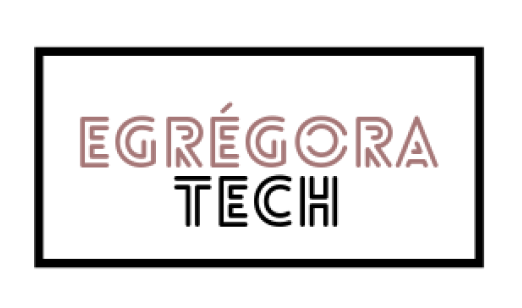

 

# EGRÉGORA TECH
Você, mulher da área tech , já se sentiu insegura com seus primeiros passos nessa carreira? Já pensou como seria importante ter outra mulher que já atua na área te guiando sobre como montar seu CV, como se portar em uma entrevista ou te indicando os melhores cursos? Qual a diferença que uma mentoria faria na sua trajetória? A Egrégora Tech é uma comunidade que conecta mulheres da área de tecnologia para darem e receberem mentoria, e fazerem suas carreiras decolarem! 

## Features
✅  Fazer cadastro; 

✅  Criar perfil (mentora ou mentorada);

✅  Fazer buscas por perfil de atuação  (frontend, backend, ...);

## Aplicação web
✅  Layout para desktop;

## Framework

✅  React;

## Deploy

- via heroku
✅  https://egregora-tech.herokuapp.com/

*Alerta: pode demorar um pouco pra acessar o banco de dados;
